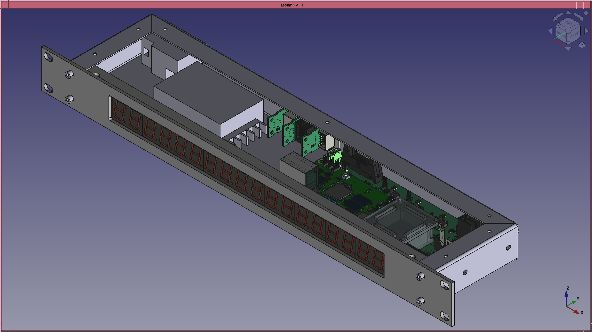

# NTP Server based on GPS disciplined OCXO

* [MicroZed](http://zedboard.org/product/microzed) processor board
* Xilinx Zynq 7010 ARM processor/fpga
* STRATUM 3E High Stability Oven Stabilized Oscillator
* GlobalTop LadyBird-1 GPS Receiver
* 16 Digit non-multiplexed time/info display
* 1U case 4 inches deep

Case

Main PCB

Display

